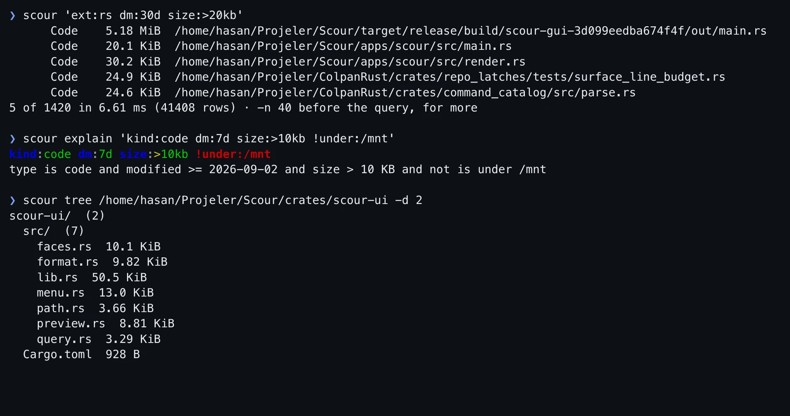
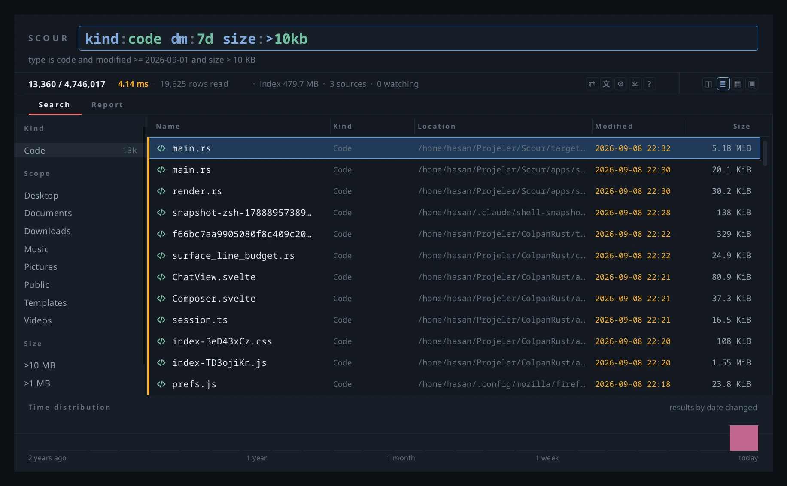
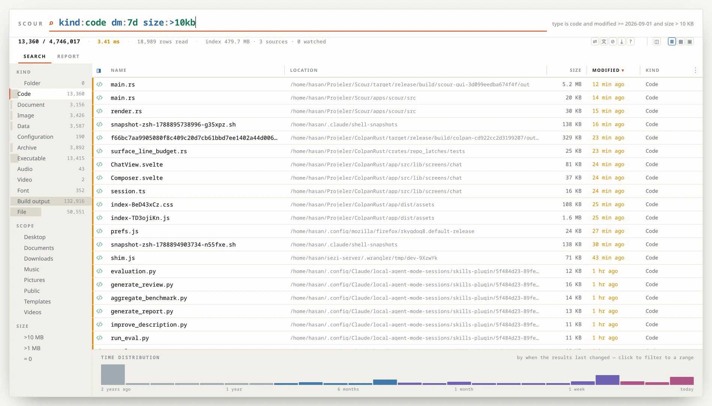
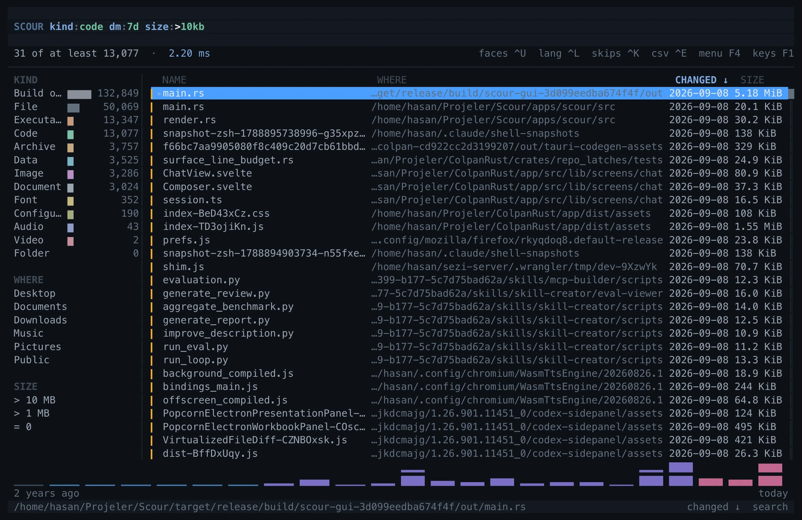

# Scour

*Türkçe: [README.tr.md](README.tr.md)*

Scour is a file indexer and search tool for Linux. It keeps every file and
folder of the configured volumes in an index of its own, updates the index as
the filesystem changes, and answers searches from it in milliseconds. The same
index is exposed to language models through an MCP server. Scour is written in
Rust and depends on no external search engine or database.

**[revisetouch.com/scour](https://revisetouch.com/scour)** ·
**[Documentation](https://revisetouch.com/en/docs/scour/introduction)** ·
**[Releases](https://github.com/ReviseTouch/Scour/releases)**

> **Alpha release.** Scour is in daily use on one Linux machine, against an
> index of 4.8 million entries, and its measurements come from there. The
> Windows build has been started on one machine and is otherwise untested.
> macOS compiles and has not been run. The index format may change between
> releases.

```
$ scour "ext:rs size:>10kb dm:7d"
      Code    5.18 MiB  /home/u/Projeler/Scour/target/release/build/scour-gui/out/main.rs
      Code    20.1 KiB  /home/u/Projeler/Scour/apps/scour/src/main.rs
      Code    30.2 KiB  /home/u/Projeler/Scour/apps/scour/src/render.rs
      Code    24.9 KiB  /home/u/Projeler/ColpanRust/crates/repo_latches/tests/surface_line_budget.rs
      Code    13.8 KiB  /home/u/Projeler/ColpanRust/crates/command_catalog/tests/panels.rs
5 of 1705 in 3.27 ms (28000 rows) · -n 40 for more
```

At a terminal the command prints five rows; when piped, forty. `-n` sets the
number.

## Interfaces

One service (`scourd`) holds the index; four interfaces connect to it over a
local socket and share its settings. The screenshots below were taken at the
same time with the same query, `kind:code dm:7d size:>10kb`, on an index of
4.7 million entries.

**Command line** — `scour`



**Window** — `scour-gui`, a native Slint application



**Browser** — `scour-web`, a local bridge that serves one page



**Terminal** — `scour-tui`, a full-screen terminal interface



## Performance

`find` walks the filesystem on every query. Scour walks it once, keeps an index
and follows changes. On the live index (4.8 million entries, 493 MiB on disk),
measured as complete round trips — socket, parse, search, sort, count and
forty rows:

| query | ms |
|---|---:|
| `rapor` | 7.9 |
| `size:>10mb` | 7.5 |
| `kind:code dm:7d` | 16.7 |
| `kind:image` (1.6 million matches) | 37.3 |

The index is memory-mapped: it lives in the page cache and the kernel can
reclaim it under pressure, so searching costs tens of megabytes of resident
memory rather than the size of the index. Change notifications are not
treated as complete: every source also receives a full reconciliation pass,
every 30 minutes by default, and every minute on a source with neither a watch
nor a write counter. The measurements and the commands that produced them are
in [docs/MEASUREMENTS.md](docs/MEASUREMENTS.md).

## Installation

### From a release

```bash
tar xzf scour-0.2.0-alpha.1-linux-x86_64.tar.gz
cd scour-0.2.0-alpha.1-linux-x86_64
./install.sh
```

The script does not require a password. It installs seven binaries into
`~/.local/bin`, a menu entry and an icon into `~/.local/share`, and on GNOME
and KDE binds **Super+F** to the window (`SCOUR_KEY=ctrl+alt+s` selects another
key, `SCOUR_KEY=none` skips the binding). Removing those files uninstalls it.

The binaries are built against glibc 2.39: Ubuntu 24.04 and later, Debian 13
and later, Fedora 40 and later, and rolling distributions. Older releases
require building from source. The package was installed and run in clean
Ubuntu 24.04 and Fedora containers.

**Windows.** The workspace builds for `x86_64-pc-windows-msvc`, and the
release includes a zip. The binaries were started once on one Windows machine:
the service indexed and the command line searched. The window, live watching,
network and FAT32 volumes have not been tested there, and there is no USN
journal reader, so the first scan walks the disk. **macOS** compiles and has
not been run. A CI job checks that all three targets compile.

### From source

Requirements: Rust 1.88 or later ([rustup](https://rustup.rs)), `pkg-config`,
and the fontconfig development headers, which only the window needs:

| distribution | packages |
|---|---|
| Ubuntu, Debian | `sudo apt install pkg-config libfontconfig1-dev` |
| Fedora | `sudo dnf install pkgconf fontconfig-devel` |
| Arch | `sudo pacman -S pkgconf fontconfig` |

```bash
git clone https://github.com/ReviseTouch/Scour.git
cd Scour
cargo build --release
scripts/release                      # assembles dist/scour-<version>-linux-x86_64.tar.gz
cd dist && tar xzf scour-*-linux-x86_64.tar.gz && cd scour-*-linux-x86_64 && ./install.sh
```

A clean build takes a few minutes. If a C compiler is present it is used to
pin two libm symbols so the window also runs on older glibc versions; without
one the build still completes. To install by hand instead of `install.sh`:
`install -m755 target/release/scour{,d,-gui,-tui,-web,-watch,-mcp} ~/.local/bin/`
(no menu entry and no shortcut in that case).

### Keyboard shortcut

The installer binds a key on GNOME and KDE. On other desktops, bind any key to
`scour-gui`: the first press opens the window and every later press brings the
same window forward; a second instance is never started.

| desktop | location |
|---|---|
| GNOME | Settings → Keyboard → Keyboard Shortcuts → Custom Shortcuts, command `scour-gui` |
| KDE Plasma | System Settings → Shortcuts → Add Command, `scour-gui` |
| other | the compositor's key binding, command `scour-gui` |

Under GNOME on Wayland a program may not raise its own window; the window may
be indicated in the taskbar instead of coming to the front. The Shell
extension in `platform/gnome` provides this, and `scripts/install-desktop`
installs it together with a binding.

### Watching the filesystem

On Linux, Scour watches with one `fanotify` mark per volume. The cost does not
depend on the number of directories. Placing a mark requires `CAP_SYS_ADMIN`;
`scourd` does not hold that capability. A separate helper, `scour-watch`,
places the marks, passes the descriptor on, drops the privilege and executes
`scourd`.

inotify is not used and there is no inotify fallback. inotify requires one
watch per directory from a budget shared by every program in the session;
exhausting it makes unrelated programs fail. Without a mark, `scourd`
reconciles a volume by walking it when the volume's write counter changes;
no change is lost, but changes appear later. Network and FUSE mounts have no
write counter and require the mark.

```bash
sudo bash packaging/install-service.sh [--user NAME] [ROOT...]   # the only step that requires root
systemctl start scour.service
```

The account defaults to the user who ran `sudo`; the roots — the filesystems
to mark — default to `/home`. The installer places the helper under
root-owned `/usr/local/libexec/scour`, installs a system unit, and installs a
polkit rule that allows that one account to start, stop and restart this one
service without authentication. Read both files before installing. If the user
unit is enabled, disable it first: `systemctl --user disable --now
scourd.service`.

### Settings

Settings are in `~/.config/scour/config.toml`. The exclusion lists determine
what is left out of the index; consult them when an expected file is missing.

## Query language

Whitespace is AND, `|` is OR, `!` is NOT, quotes enclose a phrase, `*` and `?`
are wildcards, and `field:value` restricts a field.

```
rapor ext:pdf dm:30d          PDFs with "rapor" in the name, modified in the last 30 days
*.log size:>100mb             log files over 100 MB
under:/home/u/Projeler *.rs   Rust files anywhere under one directory
path:src ext:rs !test         Rust files under src, excluding tests
kind:image dm:today           images modified today
```

`scour syntax` prints the reference. Searching is case-insensitive, and the
Turkish letters `i`, `ı`, `I` and `İ` are treated as one. Parsing does not
fail: an unrecognised field is searched for as text, and `scour explain
"<query>"` shows how a query was read.

## MCP server

`scour-mcp` is a Model Context Protocol server with eleven read-only tools.
Every answer is bounded and states when it was truncated: `scour_tree` lists a
directory of a million entries as quickly as one of ten and reports how many
entries were omitted; `scour_count` returns a count without a listing;
`scour_facets` summarises a set of files by kind, extension or directory;
`scour_sources` reports which paths are indexed. Rescanning, maintenance and
shutdown exist in the protocol and are not exposed to the model.

`scour mcp-config` prints the configuration for a client and the file it
belongs in:

| client | command |
|---|---|
| Claude Desktop | `scour mcp-config` → `claude_desktop_config.json` |
| Claude Code | `scour mcp-config --for claude-code` → a `claude mcp add` command |
| Codex | `scour mcp-config --for codex` → `~/.codex/config.toml` |
| Cursor | `scour mcp-config --for cursor` → `~/.cursor/mcp.json` |
| Gemini CLI | `scour mcp-config --for gemini` → `~/.gemini/settings.json` |
| VS Code | `scour mcp-config --for vscode` → `.vscode/mcp.json` |

`scourd` must be running; the MCP server is a client of it like every other
interface.

## Architecture

Only `scour-core` — types and traits — is depended on by more than one layer.

```
   scour (CLI)   scour-mcp   scour-web   scour-gui   scour-tui
        └─────────────── scour-proto ───────────────┘
                              │
                          scour-ipc          local socket, NDJSON
                              │
                           scourd            the only place concrete types are named
                              │
                        scour-engine         Box<dyn Source>, Arc<dyn Index>
                              │
         ┌─────────────── scour-core ───────────────┐
         │               types + traits             │
  scour-index-native   scour-source-fs   scour-query   scour-config   scour-i18n
```

The engine receives a source and an index through traits and does not know
their concrete types; replacing the index implementation is a one-line change
in `scourd`. The index stores rows newest first, keeps displayed text outside
the sorted columns, and indexes every ancestor directory as a term, so
removing a subtree is a single operation. The test suite compares every query
shape against a brute-force reference implementation.

Details: [docs/ARCHITECTURE.md](docs/ARCHITECTURE.md); the file-kind taxonomy:
[docs/TAXONOMY.md](docs/TAXONOMY.md).

## Languages

English is the source language. Translations are gettext catalogues in
`lang/`, compiled into the binaries and keyed by the English text.
`SCOUR_LANG=tr scour status` selects a language for one run. Shipped: English,
Turkish.

## License

MIT or Apache-2.0, at your option.
